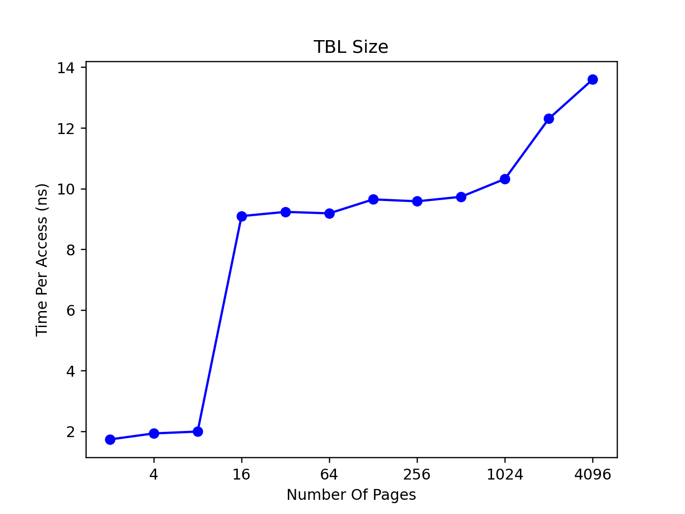

# Chapter 19. PAGING: TLBs

## Exercise 1

### For timing, you’ll need to use a timer (e.g., gettimeofday()). How precise is such a timer? How long does an operation have to take in order for you to time it precisely? (this will help determine how many times, in a loop, you’ll have to repeat a page access in order to time it successfully)

[m_getitmeofday.c](https://github.com/ilshat25/OSTEP/tree/main/19.paging-tlbs/exercises/m_gettimeofday.c)

Timer is precise is up to 1 microsecond. 

## Exercise 2

### Write the program, called `tlb.c`, that can roughly measure the cost of accessing each page. Inputs to the program should be: the number of pages to touch and the number of trials.

good article: https://people.kth.se/~johanmon/ose/assignments/tlb.pdf

[tlb.c](https://github.com/ilshat25/OSTEP/tree/main/19.paging-tlbs/exercises/tlb.c)

## Exercise 3

### Now write a script in your favorite scripting language (bash?) to run this program, while varying the number of pages accessed from 1 up to a few thousand, perhaps incrementing by a factor of two per iteration. Run the script on different machines and gather some data. How many trials are needed to get reliable measurements?

[bench.c](https://github.com/ilshat25/OSTEP/tree/main/19.paging-tlbs/exercises/bench.sh)

About 10000 trials is need on my mac 2018.

There's some result:

MacBook Pro 2018, 2,3 GHz Quad-Core Intel Core i5, 16 GB 2133 MHz LPDDR3:
```
ilssshat$ ./bench.sh 
ilssshat$ ./bench.sh 
With 2    pages and 10000 trials, average access time = 1.557850 ns
With 4    pages and 10000 trials, average access time = 1.844650 ns
With 8    pages and 10000 trials, average access time = 2.000375 ns
With 16   pages and 10000 trials, average access time = 9.268462 ns
With 32   pages and 10000 trials, average access time = 9.449809 ns
With 64   pages and 10000 trials, average access time = 9.672076 ns
With 128  pages and 10000 trials, average access time = 9.618063 ns
With 256  pages and 10000 trials, average access time = 9.237630 ns
With 512  pages and 10000 trials, average access time = 9.259252 ns
With 1024 pages and 10000 trials, average access time = 9.494111 ns
With 2048 pages and 10000 trials, average access time = 12.641704 ns
With 4096 pages and 10000 trials, average access time = 13.021222 ns
```

MacBook Pro 2021, Apple M1 Pro, 32 Gb:
```
galievilshat$ ./bench.sh
With 2     pages and 10000  trials, average access time = 2.327500 ns
With 4     pages and 10000  trials, average access time = 1.489800 ns
With 8     pages and 10000  trials, average access time = 1.208850 ns
With 16    pages and 10000  trials, average access time = 1.071325 ns
With 32    pages and 10000  trials, average access time = 1.004350 ns
With 64    pages and 10000  trials, average access time = 3.960658 ns
With 128   pages and 10000  trials, average access time = 4.133734 ns
With 256   pages and 10000  trials, average access time = 4.186300 ns
With 512   pages and 10000  trials, average access time = 4.245280 ns
With 1024  pages and 10000  trials, average access time = 4.145347 ns
With 2048  pages and 10000  trials, average access time = 4.129319 ns
With 4096  pages and 10000  trials, average access time = 3.506606 ns
```

VM, Intel Ice Lake, 16 Gb:
```
ilssshat-vm$ ./bench.sh
With 2	  pages and 10000	 trials, average access time = 2.790450 ns
With 4	  pages and 10000	 trials, average access time = 2.953200 ns
With 8	  pages and 10000	 trials, average access time = 2.917375 ns
With 16	  pages and 10000	 trials, average access time = 6.680244 ns
With 32	  pages and 10000	 trials, average access time = 7.866744 ns
With 64	  pages and 10000	 trials, average access time = 7.994564 ns
With 128  pages and 10000	 trials, average access time = 8.062719 ns
With 256  pages and 10000	 trials, average access time = 8.069072 ns
With 512  pages and 10000	 trials, average access time = 8.560427 ns
With 1024 pages and 10000	 trials, average access time = 5.749770 ns
```

## Exercise 4

### Next, graph the results, making a graph that looks similar to the one above. Use a good tool like ploticus or even zplot. Visual- ization usually makes the data much easier to digest; why do you think that is?

[Plot builder](https://github.com/ilshat25/OSTEP/tree/main/19.paging-tlbs/exercises/plot.py)

data file can be build using bench.sh script `./bench.sh > tlb.data`



As can be seen, there's two gums, on 8 (first TLB level) and 1024 (second tlb level) pages, experiment was provided on macbook pro 2019 

## Exercise 5

### One thing to watch out for is compiler optimization. Compilers do all sorts of clever things, including removing loops which increment values that no other part of the program subsequently uses. How can you ensure the compiler does not remove the main loop above from your TLB size estimator?

We can disassamble the binary:

```
ilssshat$ objdump -d tlb

tlb:    file format mach-o 64-bit x86-64

Disassembly of section __TEXT,__text:

0000000100003d60 <_time_diff>:
100003d60: 55                           pushq   %rbp
100003d61: 48 89 e5                     movq    %rsp, %rbp
100003d64: 48 89 7d f0                  movq    %rdi, -16(%rbp)
100003d68: 89 75 f8                     movl    %esi, -8(%rbp)
100003d6b: 48 89 55 e0                  movq    %rdx, -32(%rbp)
100003d6f: 89 4d e8                     movl    %ecx, -24(%rbp)
100003d72: 48 8b 45 e0                  movq    -32(%rbp), %rax
100003d76: 48 2b 45 f0                  subq    -16(%rbp), %rax
100003d7a: 89 45 dc                     movl    %eax, -36(%rbp)
100003d7d: 8b 45 e8                     movl    -24(%rbp), %eax
100003d80: 69 4d dc 40 42 0f 00         imull   $1000000, -36(%rbp), %ecx ## imm = 0xF4240
100003d87: 01 c8                        addl    %ecx, %eax
100003d89: 2b 45 f8                     subl    -8(%rbp), %eax
100003d8c: 5d                           popq    %rbp
100003d8d: c3                           retq
100003d8e: 66 90                        nop

0000000100003d90 <_main>:
100003d90: 55                           pushq   %rbp
100003d91: 48 89 e5                     movq    %rsp, %rbp
100003d94: 48 83 ec 70                  subq    $112, %rsp
100003d98: c7 45 fc 00 00 00 00         movl    $0, -4(%rbp)
100003d9f: 89 7d f8                     movl    %edi, -8(%rbp)
100003da2: 48 89 75 f0                  movq    %rsi, -16(%rbp)
100003da6: 83 7d f8 03                  cmpl    $3, -8(%rbp)
100003daa: 0f 8d 22 00 00 00            jge     0x100003dd2 <_main+0x42>
100003db0: 48 8b 05 49 02 00 00         movq    585(%rip), %rax         ## 0x100004000 <_printf+0x100004000>
100003db7: 48 8b 38                     movq    (%rax), %rdi
100003dba: 48 8d 35 af 01 00 00         leaq    431(%rip), %rsi         ## 0x100003f70 <_printf+0x100003f70>
100003dc1: 31 c0                        xorl    %eax, %eax
100003dc3: e8 8c 01 00 00               callq   0x100003f54 <_printf+0x100003f54>
100003dc8: bf 01 00 00 00               movl    $1, %edi
100003dcd: e8 7c 01 00 00               callq   0x100003f4e <_printf+0x100003f4e>
100003dd2: 48 8b 45 f0                  movq    -16(%rbp), %rax
100003dd6: 48 8b 78 08                  movq    8(%rax), %rdi
100003dda: e8 69 01 00 00               callq   0x100003f48 <_printf+0x100003f48>
100003ddf: 89 45 ec                     movl    %eax, -20(%rbp)
100003de2: 48 8b 45 f0                  movq    -16(%rbp), %rax
100003de6: 48 8b 78 10                  movq    16(%rax), %rdi
100003dea: e8 59 01 00 00               callq   0x100003f48 <_printf+0x100003f48>
100003def: 89 45 e8                     movl    %eax, -24(%rbp)
100003df2: c7 45 e4 00 04 00 00         movl    $1024, -28(%rbp)        ## imm = 0x400
100003df9: 48 c7 45 b8 00 00 00 00      movq    $0, -72(%rbp)
100003e01: 48 c7 45 b0 00 00 00 00      movq    $0, -80(%rbp)
100003e09: 48 8d 7d d0                  leaq    -48(%rbp), %rdi
100003e0d: 31 c0                        xorl    %eax, %eax
100003e0f: 89 c6                        movl    %eax, %esi
100003e11: e8 44 01 00 00               callq   0x100003f5a <_printf+0x100003f5a>
100003e16: c7 45 ac 00 00 00 00         movl    $0, -84(%rbp)
100003e1d: 8b 45 ac                     movl    -84(%rbp), %eax
100003e20: 3b 45 e8                     cmpl    -24(%rbp), %eax
100003e23: 0f 8d 7b 00 00 00            jge     0x100003ea4 <_main+0x114>
100003e29: c7 45 a8 00 00 00 00         movl    $0, -88(%rbp)
100003e30: 81 7d a8 e8 03 00 00         cmpl    $1000, -88(%rbp)        ## imm = 0x3E8
100003e37: 0f 8d 54 00 00 00            jge     0x100003e91 <_main+0x101>
100003e3d: c7 45 a4 00 00 00 00         movl    $0, -92(%rbp)
100003e44: 8b 45 a4                     movl    -92(%rbp), %eax
100003e47: 3b 45 ec                     cmpl    -20(%rbp), %eax
100003e4a: 0f 8d 2e 00 00 00            jge     0x100003e7e <_main+0xee>
100003e50: 8b 45 a4                     movl    -92(%rbp), %eax
100003e53: c1 e0 0a                     shll    $10, %eax
100003e56: 48 63 c8                     movslq  %eax, %rcx
100003e59: 48 8d 05 a0 41 00 00         leaq    16800(%rip), %rax       ## 0x100008000 <_arr>
100003e60: 8b 14 88                     movl    (%rax,%rcx,4), %edx
100003e63: 83 c2 01                     addl    $1, %edx
100003e66: 48 8d 05 93 41 00 00         leaq    16787(%rip), %rax       ## 0x100008000 <_arr>
100003e6d: 89 14 88                     movl    %edx, (%rax,%rcx,4)
100003e70: 8b 45 a4                     movl    -92(%rbp), %eax
100003e73: 83 c0 01                     addl    $1, %eax
100003e76: 89 45 a4                     movl    %eax, -92(%rbp)
100003e79: e9 c6 ff ff ff               jmp     0x100003e44 <_main+0xb4>
100003e7e: e9 00 00 00 00               jmp     0x100003e83 <_main+0xf3>
100003e83: 8b 45 a8                     movl    -88(%rbp), %eax
100003e86: 83 c0 01                     addl    $1, %eax
100003e89: 89 45 a8                     movl    %eax, -88(%rbp)
100003e8c: e9 9f ff ff ff               jmp     0x100003e30 <_main+0xa0>
100003e91: e9 00 00 00 00               jmp     0x100003e96 <_main+0x106>
100003e96: 8b 45 ac                     movl    -84(%rbp), %eax
100003e99: 83 c0 01                     addl    $1, %eax
100003e9c: 89 45 ac                     movl    %eax, -84(%rbp)
100003e9f: e9 79 ff ff ff               jmp     0x100003e1d <_main+0x8d>
100003ea4: 31 c0                        xorl    %eax, %eax
100003ea6: 89 c6                        movl    %eax, %esi
100003ea8: 48 8d 7d c0                  leaq    -64(%rbp), %rdi
100003eac: e8 a9 00 00 00               callq   0x100003f5a <_printf+0x100003f5a>
100003eb1: 48 8b 7d d0                  movq    -48(%rbp), %rdi
100003eb5: 8b 75 d8                     movl    -40(%rbp), %esi
100003eb8: 48 8b 55 c0                  movq    -64(%rbp), %rdx
100003ebc: 8b 4d c8                     movl    -56(%rbp), %ecx
100003ebf: e8 9c fe ff ff               callq   0x100003d60 <_time_diff>
100003ec4: 89 c0                        movl    %eax, %eax
100003ec6: 89 c1                        movl    %eax, %ecx
100003ec8: 48 8b 45 b8                  movq    -72(%rbp), %rax
100003ecc: 48 01 c8                     addq    %rcx, %rax
100003ecf: 48 89 45 b8                  movq    %rax, -72(%rbp)
100003ed3: 8b 45 ec                     movl    -20(%rbp), %eax
100003ed6: 89 45 98                     movl    %eax, -104(%rbp)
100003ed9: 48 8b 45 b8                  movq    -72(%rbp), %rax
100003edd: 48 89 c2                     movq    %rax, %rdx
100003ee0: 48 d1 ea                     shrq    %rdx
100003ee3: 89 c1                        movl    %eax, %ecx
100003ee5: 83 e1 01                     andl    $1, %ecx
100003ee8: 48 09 d1                     orq     %rdx, %rcx
100003eeb: f3 48 0f 2a c1               cvtsi2ss        %rcx, %xmm0
100003ef0: f3 0f 58 c0                  addss   %xmm0, %xmm0
100003ef4: f3 48 0f 2a c8               cvtsi2ss        %rax, %xmm1
100003ef9: f3 0f 11 4d 9c               movss   %xmm1, -100(%rbp)
100003efe: 48 85 c0                     testq   %rax, %rax
100003f01: f3 0f 11 45 a0               movss   %xmm0, -96(%rbp)
100003f06: 0f 88 0a 00 00 00            js      0x100003f16 <_main+0x186>
100003f0c: f3 0f 10 45 9c               movss   -100(%rbp), %xmm0       ## xmm0 = mem[0],zero,zero,zero
100003f11: f3 0f 11 45 a0               movss   %xmm0, -96(%rbp)
100003f16: 8b 75 98                     movl    -104(%rbp), %esi
100003f19: f3 0f 10 45 a0               movss   -96(%rbp), %xmm0        ## xmm0 = mem[0],zero,zero,zero
100003f1e: 8b 45 ec                     movl    -20(%rbp), %eax
100003f21: 0f af 45 e8                  imull   -24(%rbp), %eax
100003f25: f3 0f 2a c8                  cvtsi2ss        %eax, %xmm1
100003f29: f3 0f 5e c1                  divss   %xmm1, %xmm0
100003f2d: f3 0f 5a c0                  cvtss2sd        %xmm0, %xmm0
100003f31: 48 8d 3d 70 00 00 00         leaq    112(%rip), %rdi         ## 0x100003fa8 <_printf+0x100003fa8>
100003f38: b0 01                        movb    $1, %al
100003f3a: e8 21 00 00 00               callq   0x100003f60 <_printf+0x100003f60>
100003f3f: 31 c0                        xorl    %eax, %eax
100003f41: 48 83 c4 70                  addq    $112, %rsp
100003f45: 5d                           popq    %rbp
100003f46: c3                           retq

Disassembly of section __TEXT,__stubs:

0000000100003f48 <__stubs>:
100003f48: ff 25 ba 00 00 00            jmpq    *186(%rip)              ## 0x100004008 <_printf+0x100004008>
100003f4e: ff 25 bc 00 00 00            jmpq    *188(%rip)              ## 0x100004010 <_printf+0x100004010>
100003f54: ff 25 be 00 00 00            jmpq    *190(%rip)              ## 0x100004018 <_printf+0x100004018>
100003f5a: ff 25 c0 00 00 00            jmpq    *192(%rip)              ## 0x100004020 <_printf+0x100004020>
100003f60: ff 25 c2 00 00 00            jmpq    *194(%rip)              ## 0x100004028 <_printf+0x100004028>
```

You can see `100003e63: 83 c2 01                     addl    $1, %edx` wrapped in three cycles

## Exercise 6

### Another thing to watch out for is the fact that most systems today ship with multiple CPUs, and each CPU, of course, has its own TLB hierarchy. To really get good measurements, you have to run your code on just one CPU, instead of letting the scheduler bounce it from one CPU to the next. How can you do that? (hint: look up “pinning a thread” on Google for some clues) What will happen if you don’t do this, and the code moves from one CPU to the other?

Tried to this on macos through the mask [tlb_single_cpu](https://github.com/ilshat25/OSTEP/tree/main/19.paging-tlbs/exercises/tlb_single_cpu.c), but there's no difference

If CPU will move the process it will flush the cache and picks could be seen on the graph 

## Exercise 7

### Another issue that might arise relates to initialization. If you don’t initialize the array a above before accessing it, the first time you access it will be very expensive, due to initial access costs such as demand zeroing. Will this affect your code and its timing? What can you do to counterbalance these potential costs?

Tried to initialized array before measuring, [tlb_with_init][tlb_single_cpu](https://github.com/ilshat25/OSTEP/tree/main/19.paging-tlbs/exercises/tlb_with_init.c)
but this didn't change the results