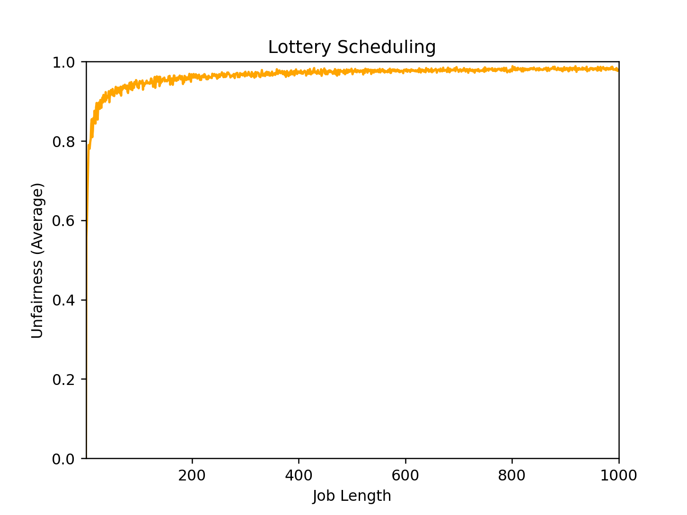
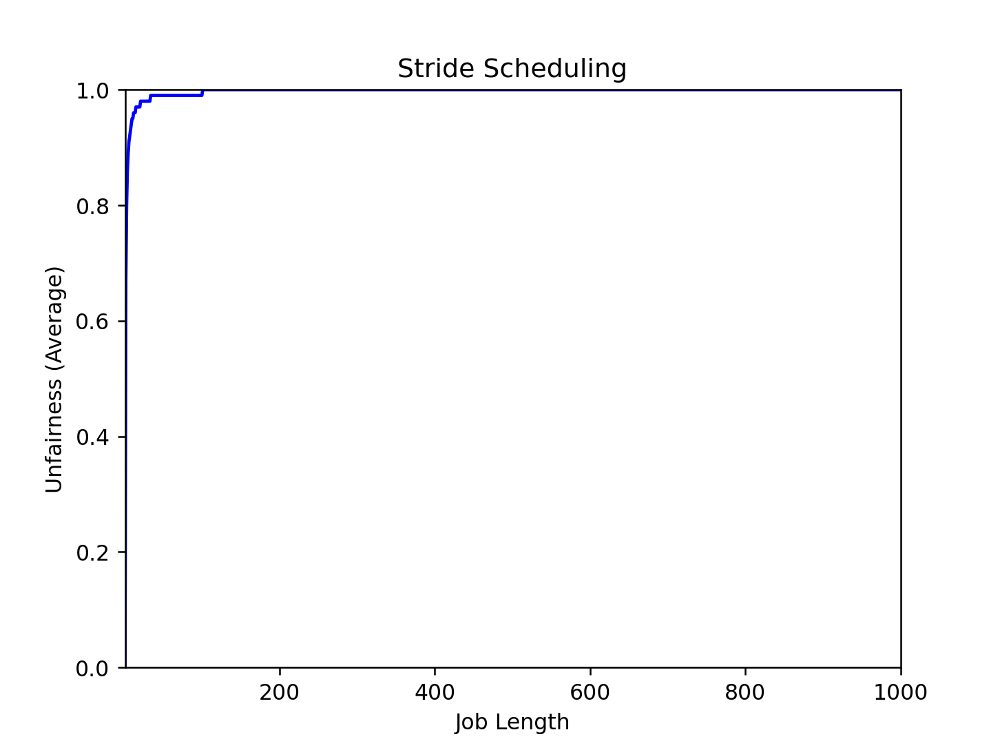

# Chapter 9 PROPORTIONAL SHARE

## Exercise 1

### Compute the solutions for simulations with 3 jobs and random seeds of 1, 2, and 3.

```
$ python lottery.py -s 1 -j 3
ARG jlist 
ARG jobs 3
ARG maxlen 10
ARG maxticket 100
ARG quantum 1
ARG seed 1

Here is the job list, with the run time of each job: 
  Job 0 ( length = 1, tickets = 84 )
  Job 1 ( length = 7, tickets = 25 )
  Job 2 ( length = 4, tickets = 44 )


Here is the set of random numbers you will need (at most):
Random 51593 % 153 = 119  -> Job 2 (3 left)
Random 788724 % 153 = 9    -> Job 0 (0 left) finished
Random 93859 % 69 = 19     -> Job 1 (6 left)
Random 28347 % 69 = 57     -> Job 2 (2 left) 
Random 835765 % 69 = 37    -> Job 2 (1 left)
Random 432767 % 69 = 68    -> Job 2 (0 left) finished
Random 762280 % 25 = 5     -> Job 1 (5 left)
Random 2106 % 25 = 6       -> Job 1 (4 left)
Random 445387 % 25 = 12    -> Job 1 (3 left)
Random 721540 % 25 = 15    -> Job 1 (2 left)
Random 228762 % 25 = 12    -> Job 1 (1 left)
Random 945271 % 25 = 21    -> Job 1 (0 left) finised
```

```
$ python lottery.py -s 2 -j 3
ARG jlist 
ARG jobs 3
ARG maxlen 10
ARG maxticket 100
ARG quantum 1
ARG seed 2

Here is the job list, with the run time of each job: 
  Job 0 ( length = 9, tickets = 94 )
  Job 1 ( length = 8, tickets = 73 )
  Job 2 ( length = 6, tickets = 30 )


Here is the set of random numbers you will need (at most):
Random 605944 % 197 = 169   -> Job 2 (5 left)
Random 606802 % 197 = 42    -> Job 0 (8 left)
Random 581204 % 197 = 54    -> Job 0 (7 left)
Random 158383 % 197 = 192   -> Job 2 (4 left)
Random 430670 % 197 = 28    -> Job 0 (6 left)
Random 393532 % 197 = 123   -> Job 1 (7 left)
Random 723012 % 197 = 22    -> Job 0 (5 left)
Random 994820 % 197 = 167   -> Job 2 (3 left)
Random 949396 % 197 = 53    -> Job 0 (4 left)
Random 544177 % 197 = 63    -> Job 0 (3 left)
Random 444854 % 197 = 28    -> Job 0 (2 left)
Random 268241 % 197 = 124   -> Job 1 (6 left)
Random 35924 % 197 = 70     -> Job 0 (1 left)
Random 27444 % 197 = 61     -> Job 0 (0 left) finished
Random 464894 % 103 = 55    -> Job 1 (5 left)
Random 318465 % 103 = 92    -> Job 2 (2 left)
Random 380015 % 103 = 48    -> Job 1 (4 left)
Random 891790 % 103 = 16    -> Job 1 (3 left)
Random 525753 % 103 = 41    -> Job 1 (2 left)
Random 560510 % 103 = 87    -> Job 2 (1 left)
Random 236123 % 103 = 47    -> Job 1 (1 left)
Random 23858 % 103 = 65     -> Job 1 (0 left) finished
Random 325143 % 30 = 3      -> Job 2 (0 left) finished
```

```
$ python lottery.py -s 3 -j 3
ARG jlist 
ARG jobs 3
ARG maxlen 10
ARG maxticket 100
ARG quantum 1
ARG seed 3

Here is the job list, with the run time of each job: 
  Job 0 ( length = 2, tickets = 54 )
  Job 1 ( length = 3, tickets = 60 )
  Job 2 ( length = 6, tickets = 6 )


Here is the set of random numbers you will need (at most):
Random 13168 % 120 = 88     -> Job 1 (2 left)
Random 837469 % 120 = 109   -> Job 1 (1 left)
Random 259354 % 120 = 34    -> Job 0 (1 left)
Random 234331 % 120 = 91    -> Job 1 (0 left) finished
Random 995645 % 60 = 5      -> Job 0 (0 left) finised
Random 470263 % 6 = 1       -> Job 2 (5 left)
Random 836462 % 6 = 2       -> Job 2 (4 left)
Random 476353 % 6 = 1       -> Job 2 (3 left)
Random 639068 % 6 = 2       -> Job 2 (2 left)
Random 150616 % 6 = 4       -> Job 2 (1 left)
Random 634861 % 6 = 1       -> Job 2 (0 left) finished
```

## Exercise 2

### Now run with two specific jobs: each of length 10, but one (job 0) with just 1 ticket and the other (job 1) with 100 (e.g. -l 10:1,10:100). What happens when the number of tickets is so imbalanced? Will job 0 ever run before job 1 completes? How often? In general, what does such a ticket imbalance do to the behavior of lottery scheduling?

`$ python lottery.py -s 100 -l 10:1,10:100  -c`

The job 0 will starve but it has 1 / 101 chance to be assigned to cpu and run before job 1 completes on every step.
In general the job 0 will ever run before job 1 with probability: $$\sum_{i=1}^{10} C_{10}^i (\frac{1}{101})^i (\frac{100}{101})^{10-i} = 0.0947$$

## Exercise 3

### When running with two jobs of length 100 and equal ticket allocations of 100 (-l 100:100,100:100), how unfair is the scheduler? Run with some different random seeds to determine the (probabilistic) answer; let unfairness be determined by how much earlier one job finishes than the other.

```
$ python lottery.py -s 100 -l 100:100,100:100 -c
diff: 200 - 185 = 15
U: 185 / 200 = 92.5
$ python lottery.py -s 200 -l 100:100,100:100 -c
diff: 200 - 197 = 3
U: 197 / 200 = 98.5
$ python lottery.py -s 300 -l 100:100,100:100 -c
diff: 200 - 198 = 2
U: 198 / 200 = 99
$ python lottery.py -s 400 -l 100:100,100:100 -c
diff: 200 - 195 = 5
U: 195 / 200 = 97.5
$ python lottery.py -s 500 -l 100:100,100:100 -c
diff: 200 - 186 = 14
U: 186 / 200 = 93

in average diff: (15 + 3 + 2 + 5 + 14) / 5 = 7.8
in average U: (92.5 + 98.5 + 99 + 97.5 + 93) / 5 = 96.1
```

## Exercise 4

### How does your answer to the previous question change as the quantum size (-q) gets larger?

As the quantum size is growing the fairness becomes more because the number of lotteries is falling. Actually it's the same as cut the length of jobs 

```
python lottery.py -s 100 -l 100:100,100:100 -q 2 -c
diff: 200 - 158 = 42
U: 158 / 200 = 78
python lottery.py -s 200 -l 100:100,100:100 -q 2 -c
diff: 200 - 198 = 2
U: 198 / 200 = 99
python lottery.py -s 300 -l 100:100,100:100 -q 2 -c
diff: 200 - 194 = 6
U: 194 / 200 = 97
python lottery.py -s 400 -l 100:100,100:100 -q 2 -c
diff: 200 - 196 = 4
U: 158 / 200 = 98
python lottery.py -s 500 -l 100:100,100:100 -q 2 -c
diff: 200 - 176 = 24
U: 158 / 200 = 88

in average diff: (42 + 2 + 6 + 4 + 24) / 5 = 15.6
in average U: (78 + 99 + 97 + 98 + 88) / 5 = 92.0
```

## Exercise 5

### Can you make a version of the graph that is found in the chapter? What else would be worth exploring? How would the graph look with a stride scheduler?

`$ python lottery-plot.py lottery`



`$ python lottery-plot.py stride`


